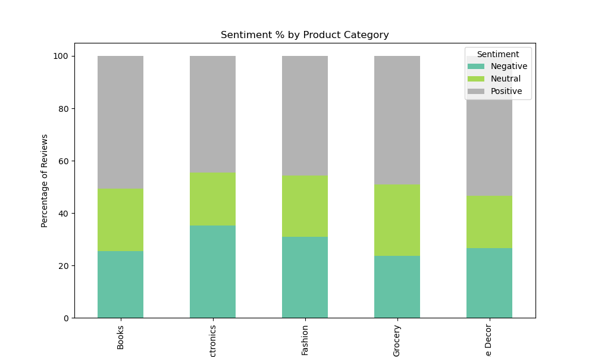
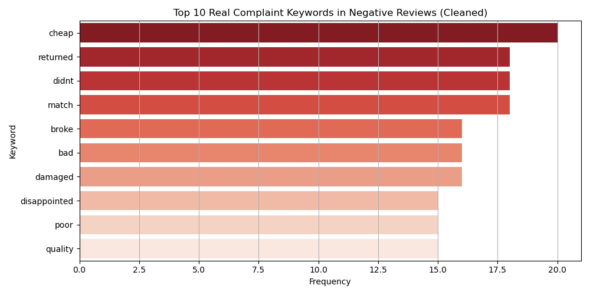
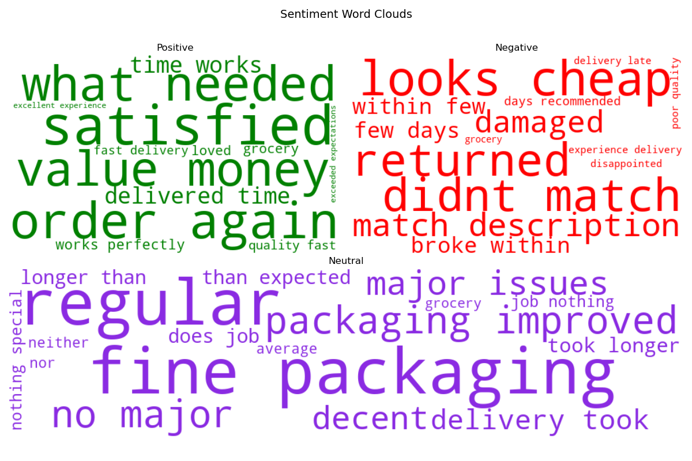

# 🛍️ TrendCart – CX Sentiment Intelligence Platform

This project analyzes e-commerce reviews using NLP and machine learning to classify customer sentiment and extract complaint insights.

## 📌 Features
- Sentiment classification using Logistic Regression
- Complaint keyword extraction from negative reviews
- WordClouds for sentiment visualization
- Tableau-ready summary CSVs for CX and product teams

---

## 📊 Sample Visuals

### 🔹 Sentiment Trend Over Time

### 🔹 Sentiment % by Product Category

### 🔹 Top Complaint Keywords

### 🔹 WordCloud Layout (Positive | Negative | Neutral)

---

## 📁 Folder Structure

- `notebook/`: Full Jupyter Notebook pipeline
- `data/`: Processed CSVs (add locally if needed)
- `visuals/`: All `.png` charts for GitHub and reports
- `README.md`, `requirements.txt`

## 🧪 How to Run

1. Clone this repo
2. Open the notebook in `notebook/`
3. Run all cells, view visuals, export CSVs
